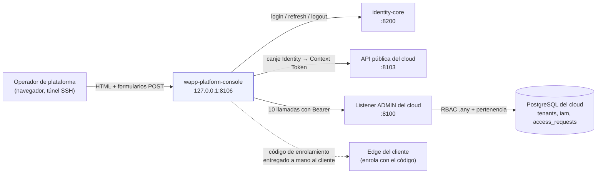
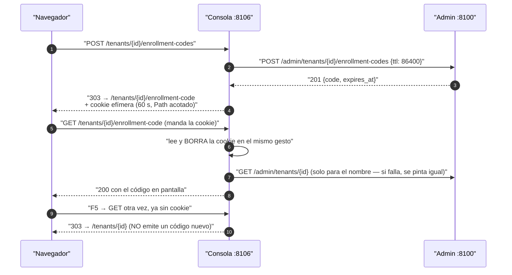

# Arquitectura de `wapp-platform-console`

Cómo está hecha por dentro. Estado verificado el **2026-08-30** sobre `main` `b89c803`.

---

## 1 · La forma de la pieza, en una frase

Es una **fachada web sin estado**: recibe una petición del navegador del operador, la traduce a una
o dos llamadas HTTP contra el listener admin `:8100` llevando el token de la sesión, y pinta el
resultado con `html/template`. **No decide nada que importe** (INV-PC1 de
[`constitucion.md`](constitucion.md)): quien autoriza es `:8100`.

Consecuencia arquitectónica que conviene tener presente: **no hay capa de dominio, ni repositorio,
ni servicio**. Hay handler y cliente HTTP, y eso es correcto para lo que la pieza es. Si te ves
añadiendo una capa de dominio aquí, probablemente el cambio pertenece al cloud.

---

## 2 · Las cuatro capas

```
navegador del operador  (túnel SSH → 127.0.0.1:8106)
        │  HTML + formularios POST, cero JavaScript
        ▼
internal/web        ★ router, middlewares, handlers, plantillas, sesión, flash
        │  llamadas tipadas
        ▼
internal/adminclient   cliente HTTP del listener admin, un fichero por dominio
        │  HTTP + Bearer
        ▼
:8100  (wapp-cloud-platform)  ← aquí vive TODO el estado y TODA la autorización
```

Fuera de esa columna quedan `internal/config` (lee el entorno), `internal/bootstrap` (envuelve el
router en un `http.Server` endurecido) y `cmd/platform-console` (arranca).

Un segundo eje, aparte del admin: el **login** va contra identity (`:8200`) y contra la API pública
(`:8103`, solo para el canje del token), a través del módulo compartido `wapp-shared/iam`.

---

## 3 · Mapa de paquetes

| Paquete | Líneas aprox. | Qué es |
|---|---|---|
| `cmd/platform-console` | 32 | Único binario. Carga config, elige el handler de `slog` (texto si el ambiente es `local`, JSON si no) y llama a `bootstrap.Run`. |
| `internal/config` | 81 | `Load()` construye el `Config` entero desde variables `WAPP_*`. **No falla nunca**: todo tiene default. |
| `internal/bootstrap` | 72 | Envuelve el router en un `http.Server` con los cuatro timeouts anti-slowloris y drena en `SIGINT`/`SIGTERM`. |
| **`internal/web`** ★ | 1.047 | **El núcleo.** Todo el comportamiento vive aquí. Siete ficheros de producción, ver desglose abajo. |
| `internal/adminclient` | 569 | Cliente HTTP tipado de `:8100`. `transport.go` (errores, cuerpos acotados, cabeceras) + un fichero por dominio. |

### Desglose de `internal/web`

| Fichero | Frase |
|---|---|
| `server.go` | Registro de **las 19 rutas** y de todos los middlewares. Es el **único** sitio del repo donde se registra una ruta. Compila las plantillas embebidas y construye los cuatro clientes. |
| `auth_handler.go` | Login, logout y `AuthMiddleware`. El middleware **no sube** al módulo compartido: depende del upstream y del perímetro de cada consola. |
| `tenants_handler.go` | Listado de empresas, ficha de empresa, corte y restauración. |
| `provisioning_handler.go` | Alta de empresa y el ciclo POST→303→GET del código de enrolamiento. |
| `access_requests_handler.go` | Bandeja de solicitudes: listar, aprobar, rechazar. |
| `session.go` | Nombres y políticas de las tres cookies, y la lectura **sin verificar firma** de los claims. |
| `flash.go` | El **vocabulario** de la consola: los códigos estables de `?error=`/`?success=` y su texto en español. |

### Desglose de `internal/adminclient`

| Fichero | Frase |
|---|---|
| `transport.go` | `Transport` (base URL + `http.Client` con timeout), construcción de peticiones con `Bearer` y `Accept`, y los cuatro tipos de error: `ErrUnauthorized`, `APIError`, `RejectionError`, `PartialApprovalError`. |
| `tenants.go` | Las seis llamadas del dominio empresas, incluida la emisión de código de enrolamiento. |
| `installations.go` | La flota de Edges de una empresa. |
| `access_requests.go` | La bandeja: listar, aprobar, rechazar. |

### Vistas

7 páginas, 1 layout (`layouts/base.html`) y 1 parcial (`partials/plan_label.html`), todas
embebidas con `//go:embed templates`. Las pantallas: **Login**, **Empresas** (portada),
**Nueva empresa**, **Empresa creada**, **Detalle de empresa**, **Código de enrolamiento** y
**Bandeja de acceso**. La barra superior es *Empresas · Nueva Empresa · Bandeja de Acceso ·
Cerrar sesión*.

El CSS son cuatro hojas: tres compartidas servidas desde `wapp-shared/ui` mediante `ui.GetCSS`
(`wapp-tokens.css`, `wapp-components.css`, `theme-platform.css`) y una propia embebida
(`static/css/app.css`, 538 líneas, **monotema clara** — ver INV-PC8).

---

## 4 · Punto de entrada y binario

**Uno solo.** `cmd/platform-console/main.go` produce el binario **`platform-console`** (así lo
nombra el `.gitignore`). No acepta flags: no usa `flag`, toda la configuración es por entorno.

Dentro del repo **no hay Dockerfile, ni unidad systemd, ni script de despliegue**. En la máquina
de UAT corre como unidad `wapp-platform-console` con el binario instalado en
`/usr/local/bin/wapp-platform-console`, pero **ese artefacto vive fuera de este repo**; aquí el
`Makefile` solo ofrece `make run`.

---

## 5 · La cadena de middlewares, en orden

El orden importa y está fijado en `internal/web/server.go`. Lo que va **antes** del CSRF queda
fuera de él:

```
gin.Recovery
  → SlogLogger          (registro estructurado de cada petición)
  → SecurityHeaders     (CSP con nonce; HSTS si está activado)
  → CORS                (fail-closed: vacío == same-origin, nunca "*")
  → RateLimit           (si está habilitado; 5 rps / burst 10 por defecto)
  ── aquí se registran las 4 rutas de CSS y /healthz ──   ← fuera del CSRF (5, `server.go:106-138`)
  → CSRF
  ── aquí se registran /login (GET y POST) y /logout ──   (3, `server.go:170-172`)
  → grupo protegido: AuthMiddleware + RequestDeadline    ← las 11 rutas restantes (`server.go:179-192`)
```

🔴 **`/healthz` queda DETRÁS del rate-limit**, porque el limitador se instala antes de registrarla.
Un monitor agresivo que comparta IP con tráfico real puede recibir un 429 en el health check.

🔴 **El rate-limit nunca limita por usuario.** Su clave combina el user id del contexto con la IP,
pero el limitador está instalado **antes** del `AuthMiddleware`, así que cuando corre, el user id
aún no está en el contexto. En la práctica limita solo por IP.

---

## 6 · Diagrama: quién habla con quién



La flecha punteada no es una conexión: el código de enrolamiento se **enseña en pantalla** al
operador, que se lo hace llegar al cliente por su cuenta. Esta consola nunca habla con un Edge.

---

## 7 · Diagrama: el ciclo del código de enrolamiento (POST-Redirect-GET)

Es el flujo con más diseño de la pieza, y el que más fácil se rompe al refactorizar (INV-PC5).



Antes de la corrección **M-10** la pantalla se renderizaba sobre el POST: un F5 reenviaba el
formulario y emitía un código **nuevo**, dejando el anterior huérfano y vivo 24 h.

---

## 8 · El patrón de respuesta: PRG con **una** excepción

- `POST /tenants/:id/revoke` y `/restore` → **303** con `?error=`/`?success=`.
- `POST /tenants/:id/enrollment-codes` → **303** a la pantalla del código.
- `POST /access-requests/:id/approve` y `/reject` → **303**.
- 🔴 **`POST /tenants/new` NO redirige.** Los dos rechazos pintan **400 repintando** el formulario,
  y **el éxito pinta la pantalla «Empresa creada» con 200 SOBRE EL POST**. Un F5 ahí **reenvía el
  alta**. Es la misma forma que M-10 vino a corregir en la ruta de al lado.
  *(Qué ocurre exactamente al reenviar —si el cloud rechaza el slug duplicado o crea una segunda
  empresa— es **NO VERIFICADO**: no se leyó la unicidad del slug en el cloud.)*

---

## 9 · Manejo de errores del upstream: qué se hace con un `:8100` caído

Tres conductas distintas, y conviene saber cuál toca al añadir una pantalla:

| Situación | Conducta hoy | Fichero |
|---|---|---|
| Falla el listado de empresas (portada) | pinta la página con **`200 OK`** y el texto «No se pudieron cargar las empresas» | `internal/web/tenants_handler.go` |
| Falla el detalle de una empresa | **redirige a `/` sin ningún flash** | `internal/web/tenants_handler.go` |
| Falla el listado de la bandeja | pinta la bandeja **vacía**, sin aviso | `internal/web/access_requests_handler.go` |
| Falla una **mutación** | 303 con un código de flash del catálogo | los tres handlers |
| Falla releer la empresa tras emitir el código | **se pinta igual**, sin el nombre — perder el código es peor | `internal/web/provisioning_handler.go` |

Las dos primeras filas son deuda anotada en [`deuda.md`](deuda.md): para una sonda o un proxy, la
portada de la consola está sana aunque el cloud esté caído.

Del lado del cliente HTTP, `internal/adminclient/transport.go` distingue cuatro errores, y la
distinción no es cosmética: `PartialApprovalError` existe porque una aprobación puede quedar **a
medias** en el servidor (lo local escrito, los sistemas de identity **no tocados a propósito**), y
eso **no es transitorio**: reintentar no lo arregla, hay que reconciliar el usuario a mano. Por eso
la consola tiene un mensaje distinto para ese caso (`approve_partial_skipped`).
